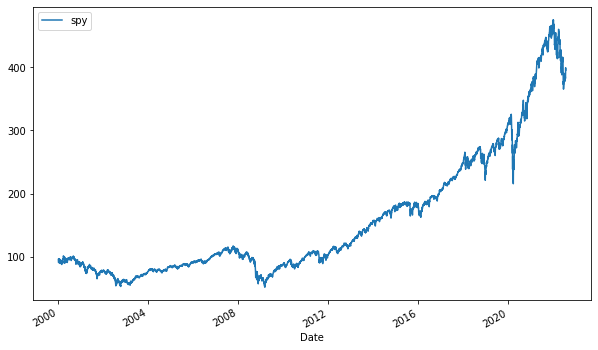
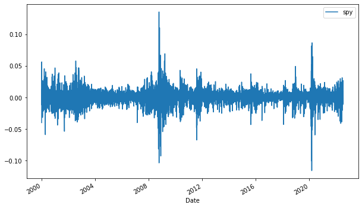
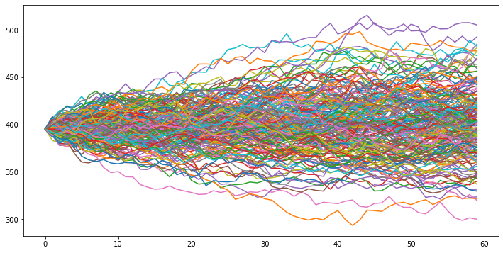

# StockForecast

An old project from 2020 which is forcasting by running a Monte Carlo simulation

## Environment

py -m venv env

env\Scripts\activate.bat

## Installing Dependencies

pip install -r requirements.txt

## Available Functions

